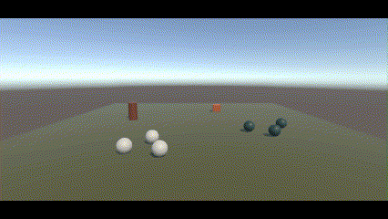
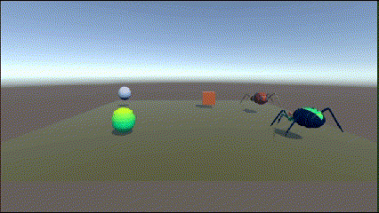

# Práctica 4 - Eventos. Delegados

### Ejercicio 1
Se han creado un cubo y un cilindro, junto con prefabs para las esferas de tipo 1 y tipo 2. La funcionalidad básica de cada uno se implementa de la siguiente forma:
- **Cubo**: Se ha creado como un `GameObject` simple, al que se le ha asignado un script llamado *ej1_cube_move*. Este script permite el movimiento del cubo mediante las teclas *W, A, S* y *D*, usando `GetKey` para detectar el input y `Translate` para mover el cubo. No se utiliza Rigidbody, ya que no se requiere interacción física avanzada en su movimiento.
- **Cilindro**: El cilindro es un `Rigidbody` con los ejes de movimiento y rotación congelados, ya que no necesita desplazarse. Su rol principal es detectar la colisión con el cubo. Para ello, se le ha asignado el script *ej1_notificador*, que lanza el evento `OnChoqueCilindro` al detectar la colisión con un objeto que tenga la etiqueta "cubo".
- **Esferas de tipo 1**: Estas esferas se crean como `Rigidbody` para observar su comportamiento en la animación. Se le asigna el script *ej_esfera_t1* en el que se suscriben al evento `OnChoqueCilindro` del cilindro, y al recibir la notificación, se desplazan hacia el cilindro. El movimiento se gestiona en el método `FixedUpdate()`, calculando la dirección hacia el cilindro y moviendo las esferas de forma gradual utilizando `MovePosition`. El movimiento se detiene cuando las esferas están lo suficientemente cerca del cilindro (determinadas por la variable minDistance).
- **Esferas de tipo 2**: La implementación es similar a las esferas de tipo 1, pero en este caso las esferas se desplazan hacia las esferas de tipo 1. En el script *ej1_esferas_t2*, se suscriben también al evento del cilindro y calculan la dirección hacia las esferas de tipo 1 en su método `FixedUpdate()`. El movimiento se detiene cuando la distancia entre ambas esferas es menor que minDistance.

### Ejercicio 2
En este ejercicio no se realizaron modificaciones en los scripts existentes. Se descargó un asset de arañas y se replicó la escena anterior con algunas adaptaciones. 
- El cubo fue duplicado, y el cilindro se sustituyó por uno de los prefabs de huevo. A este huevo se le asignó la misma etiqueta que tenía el cilindro en la escena previa, y se le añadió un componente `Rigidbody` con las mismas propiedades, junto con un `Sphere Collider` para asegurar que funcione correctamente.
- En cuanto a las arañas, se siguió un criterio similar. Se eligieron dos prefabs de arañas: uno para reemplazar a las esferas de tipo 1 y otro para las esferas de tipo 2. A ambos prefabs se les asignó un `Rigidbody` con las mismas características utilizadas anteriormente y un `Box Collider`.
- Finalmente, los scripts del ejercicio anterior se aplicaron a los nuevos elementos: el script del notificador se asignó al huevo, el de las esferas de tipo 1 a las arañas verdes, y el de las esferas de tipo 2 a las arañas negras. Se aprovechó el uso de las mismas etiquetas del ejercicio anterior para simplificar la adaptación.

### Ejercicio 3
En este ejercicio, se han realizado varias modificaciones respecto a la escena anterior. 
- **Cubo**: El cubo permanece igual que en los ejercicios anteriores, sin modificaciones adicionales.
- **Huevo de tipo 1 (verde)**: El huevo de tipo 1 se crea, pero no requiere ningún cambio en su comportamiento.
- **Huevo de tipo 2 (rojo)**: Se le añade un collider y un Rigidbody para detectar colisiones y generar notificaciones. Se le asigna el script `ej3_huevo_t2`, donde se crean dos eventos de impacto: `OnChoqueHuevoT2A1` detecta colisiones con arañas de tipo 1, `OnChoqueHuevoT2A2` detecta colisiones con arañas de tipo 2. Cuando ocurre una colisión con la araña correspondiente, se lanza el evento que desencadena una acción.
- **Araña de tipo 2 (roja)**: Se le agregan componentes collider y Rigidbody para detectar colisiones y lanzar notificaciones. El script asignado, `ej3_araña_t2`, define un evento llamado `OnChoqueArañaT2`, que se activa cuando el cubo colisiona con la araña. Además, para cambiar el color de la araña tras colisionar con el huevo de tipo 2, nos suscribimos al evento `OnChoqueHuevoT2A2`; dado que la araña es un prefab, es necesario acceder al hijo que contiene el material a cambiar; se obtiene el componente `Skinned Mesh Renderer` y se le asigna un material desde el inspector para reemplazar el existente, ya que cambiar solo el color no es suficiente.
- **Araña de tipo 1 (verde)**: Se crea con componentes collider y Rigidbody, al igual que la araña de tipo 2. Para el cambio de color, se sigue el mismo procedimiento: nos suscribimos al evento `OnChoqueHuevoT2A1` para que, cuando el huevo de tipo 2 lance este evento, se cambie el material en el componente `Skinned Mesh Renderer` por uno asignado desde el inspector. Adicionalmente, se crea un notificador para detectar el evento `OnChoqueArañaT2` lanzado por la araña de tipo 2; al recibir este evento, localizamos la posición del huevo de tipo 1 y desplazamos la araña de tipo 1 hacia dicha posición; este movimiento, al estar relacionado con un `Rigidbody`, se debe gestionar en el método `FixedUpdate`, activando una flag que se verifica en dicho método. Por último, al detectar una colisión de la araña de tipo 1 en `OnCollisionEnter`, se activa una flag similar para que la araña se desplace hacia el huevo de tipo 2, y el movimiento también se realiza en `FixedUpdate`.

### Ejercicio 4
En este ejercicio, se realizaron las siguientes modificaciones y configuraciones:
- **Cubo**: El cubo se mantiene sin cambios en su comportamiento.
- **Huevo tipo 2 (rojo)**: Se mantiene igual en su funcionalidad.
- **Huevo tipo 1 (verde)**: Para simular el acercamiento del cubo, se creó un objeto vacío al que se le asignó un componente `Rigidbody` configurado como trigger. Este objeto actúa como envoltura del huevo. Además, se le asignó el script `ej4_cubo_cerca`, el cual lanza el evento `OnCuboCerca` al detectar un trigger con el cubo.
- **Araña tipo 1 (verde)**: La araña permanece sin cambios, pero se le asignó un nuevo script `ej4_arania_t1`  que detecta el evento lanzado por el huevo tipo 1. Al detectarlo, se establece un flag que indica que se debe teletransportar. En el método `FixedUpdate`, se realiza el teletransporte hacia la posición del huevo tipo 1 utilizando `MovePosition`, ya que la araña está configurada como un `Rigidbody`.
- **Araña tipo 2**: Se presentaron algunos problemas con la rotación de esta araña, posiblemente debido a la configuración del asset. Sin embargo, finalmente se logró que funcionara. En el script `ej4_arania_t2`, la detección del evento del huevo se maneja de manera similar a la araña tipo 1; al detectar el evento, se activa un flag de rotación. En el método `FixedUpdate`, se realiza la rotación utilizando `Slerp`. Se intentó utilizar `MoveRotation` del `Rigidbody`, pero no se logró el comportamiento deseado.

### Ejercicio 5
...

### Ejercicio 6
...

### Ejercicio 7
...

### Ejercicio 8
...

### Ejercicio 9
...

